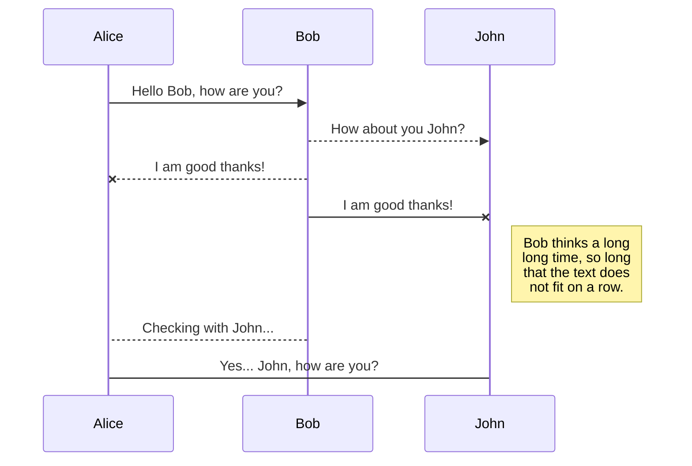

# dron-remote
 Proyecto que permite el control de un dron vía remota. El dron y cliente establecen una comunicción mediante un protocolo websocket en el que el controlClient envía instrucciones de movimientos y coordenadas

