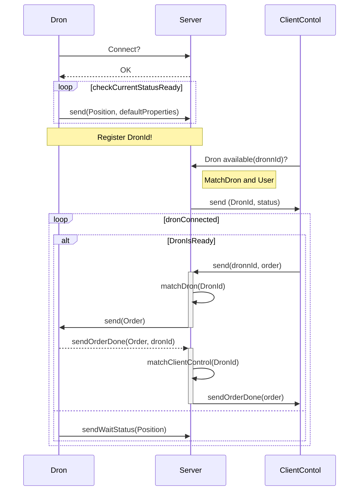

# dron-remote
 Proyecto que permite el control de un dron vía remota. El dron y cliente establecen una comunicación mediante un protocolo websocket en el que el controlClient envía instrucciones de movimientos y coordenadas para ser ejecutadas por el dron

[![](https://mermaid.ink/img/eyJjb2RlIjoic2VxdWVuY2VEaWFncmFtXG5Ecm9uLT4-U2VydmVyOiBDb25uZWN0P1xuU2VydmVyLS0-PkRyb246IE9LXG5sb29wIGNoZWNrQ3VycmVudFN0YXR1c1JlYWR5XG4gICAgRHJvbi0-PlNlcnZlcjogc2VuZChQb3NpdGlvbiwgZGVmYXVsdFByb3BlcnRpZXMpXG5lbmRcbk5vdGUgb3ZlciBEcm9uLCBTZXJ2ZXI6IFJlZ2lzdGVyIERyb25JZCFcbkNsaWVudENvbnRvbC0-PlNlcnZlcjogRHJvbiBhdmFpbGFibGUoZHJvbm5JZCk_XG5Ob3RlIHJpZ2h0IG9mIFNlcnZlcjogTWF0Y2hEcm9uIGFuZCBVc2VyXG5TZXJ2ZXItPj5DbGllbnRDb250b2w6IHNlbmQgKERyb25JZCwgc3RhdHVzKVxubG9vcCBkcm9uQ29ubmVjdGVkXG4gICAgYWx0IERyb25Jc1JlYWR5XG4gICAgICAgIENsaWVudENvbnRvbC0-PitTZXJ2ZXI6IHNlbmQoZHJvbm5JZCwgb3JkZXIpXG4gICAgICAgIFNlcnZlci0-PlNlcnZlcjogbWF0Y2hEcm9uKERyb25JZClcbiAgICAgICAgU2VydmVyLT4-LURyb246IHNlbmQoT3JkZXIpXG4gICAgICAgIERyb24tLT4-K1NlcnZlcjogc2VuZE9yZGVyRG9uZShPcmRlciwgZHJvbklkKVxuICAgICAgICBTZXJ2ZXItPj5TZXJ2ZXI6IG1hdGNoQ2xpZW50Q29udHJvbChEcm9uSWQpXG4gICAgICAgIFNlcnZlci0-Pi1DbGllbnRDb250b2w6IHNlbmRPcmRlckRvbmUob3JkZXIpXG4gICAgZWxzZVxuICAgIERyb24tPj5TZXJ2ZXI6IHNlbmRXYWl0U3RhdHVzKFBvc2l0aW9uKVxuICAgIGVuZFxuZW5kIiwibWVybWFpZCI6eyJ0aGVtZSI6ImRhcmsifSwidXBkYXRlRWRpdG9yIjpmYWxzZSwiYXV0b1N5bmMiOnRydWUsInVwZGF0ZURpYWdyYW0iOmZhbHNlfQ)](https://mermaid-js.github.io/mermaid-live-editor/edit#eyJjb2RlIjoic2VxdWVuY2VEaWFncmFtXG5Ecm9uLT4-U2VydmVyOiBDb25uZWN0P1xuU2VydmVyLS0-PkRyb246IE9LXG5sb29wIGNoZWNrQ3VycmVudFN0YXR1c1JlYWR5XG4gICAgRHJvbi0-PlNlcnZlcjogc2VuZChQb3NpdGlvbiwgZGVmYXVsdFByb3BlcnRpZXMpXG5lbmRcbk5vdGUgb3ZlciBEcm9uLCBTZXJ2ZXI6IFJlZ2lzdGVyIERyb25JZCFcbkNsaWVudENvbnRvbC0-PlNlcnZlcjogRHJvbiBhdmFpbGFibGUoZHJvbm5JZCk_XG5Ob3RlIHJpZ2h0IG9mIFNlcnZlcjogTWF0Y2hEcm9uIGFuZCBVc2VyXG5TZXJ2ZXItPj5DbGllbnRDb250b2w6IHNlbmQgKERyb25JZCwgc3RhdHVzKVxubG9vcCBkcm9uQ29ubmVjdGVkXG4gICAgYWx0IERyb25Jc1JlYWR5XG4gICAgICAgIENsaWVudENvbnRvbC0-PitTZXJ2ZXI6IHNlbmQoZHJvbm5JZCwgb3JkZXIpXG4gICAgICAgIFNlcnZlci0-PlNlcnZlcjogbWF0Y2hEcm9uKERyb25JZClcbiAgICAgICAgU2VydmVyLT4-LURyb246IHNlbmQoT3JkZXIpXG4gICAgICAgIERyb24tLT4-K1NlcnZlcjogc2VuZE9yZGVyRG9uZShPcmRlciwgZHJvbklkKVxuICAgICAgICBTZXJ2ZXItPj5TZXJ2ZXI6IG1hdGNoQ2xpZW50Q29udHJvbChEcm9uSWQpXG4gICAgICAgIFNlcnZlci0-Pi1DbGllbnRDb250b2w6IHNlbmRPcmRlckRvbmUob3JkZXIpXG4gICAgZWxzZVxuICAgIERyb24tPj5TZXJ2ZXI6IHNlbmRXYWl0U3RhdHVzKFBvc2l0aW9uKVxuICAgIGVuZFxuZW5kIiwibWVybWFpZCI6IntcbiAgXCJ0aGVtZVwiOiBcImRhcmtcIlxufSIsInVwZGF0ZUVkaXRvciI6ZmFsc2UsImF1dG9TeW5jIjp0cnVlLCJ1cGRhdGVEaWFncmFtIjpmYWxzZX0)
